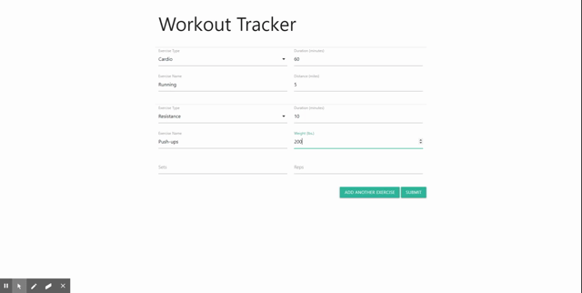

# Workout Tracker

## Description

Workout Tracker is a full-stack web application that allows users to track workouts and exercises within those workouts. It uses MongoDB to store the data.

[Deployed here](https://jdj-workout-tracker.herokuapp.com/).

## Table of Contents

* [Installation](#installation)
* [Usage](#usage)
* [Contributing](#contributing)
* [Tests](#tests)
* [License](#license)
* [Questions](#questions)

## Installation

Run `npm install`, then configure your database connection in `server.js`.

## Usage

Check out my deployed application, or install and then run `npm start` and navigate to `localhost:3000`.

## Contributing

Feel free to fork/pull.

## Tests

Workout Tracker has no test code.

## License

[MIT License](https://opensource.org/licenses/MIT)

A short and simple permissive license with conditions only requiring preservation of copyright and license notices. Licensed works, modifications, and larger works may be distributed under different terms and without source code.

## Questions

If you have questions take a look at my GitHub

[JohnDJake](https://github.com/JohnDJake)

Or send me an email

[john.d.jake@gmail.com](mailto:john.d.jake@gmail.com)

